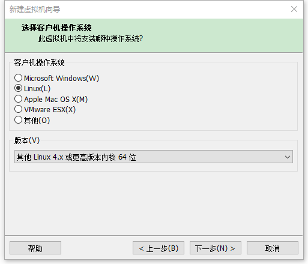
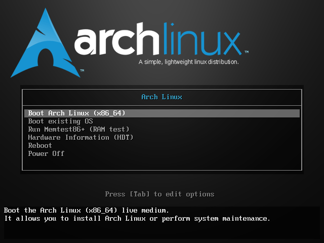
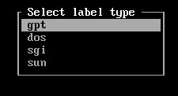
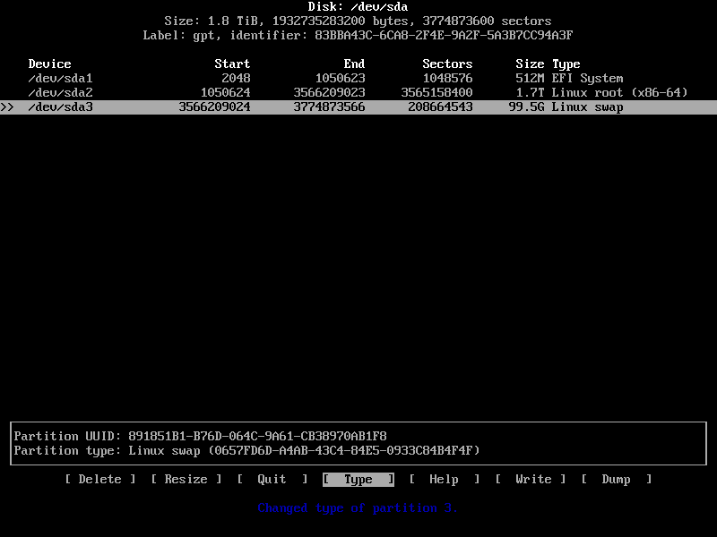
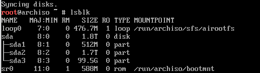
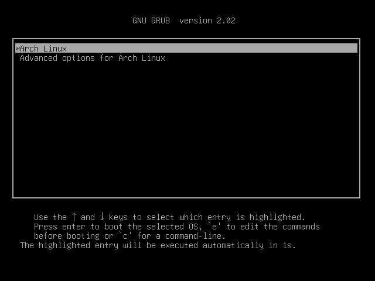

## vm虚拟机安装 arch 

内核应该是Kernel: 4.19.4

4g内存 1800g硬盘,其余默认



镜像 archlinux-2018.12.01-x86_64.iso



进去以后会出现Archlinux的live iso的启动菜单。如果要安装64位的arch，就选择第一项x86_64；如果想安装32位的arch，就选择第二项那个86的选项。然后等待片刻，进入arch live iso的终端命令行。默认为root用户，拥有所有权限，可以使用任何命令。


测试网络状态 :
```
# ping www.baidu.com
如果ping的结果是找不到该主机，可能是由于dhcp服务没有开启，使用
# systemctl dhcpcd.service
```

测试系统时间

```
# timedatectl status
查看一下系统时间状态，如果时间不对的话可以输入
# timedatectl set-ntp true

```

测试存储设备

```
# lsblk

cfdisk /dev/sda
```


New 512M 1700G type类型要选择对,然后write 写入,yes.再quit






``` 
分区完成后，需要对分区做格式化处理，由于这里使用了EFI分区，因为EFI分区需要FAT32文件格式（如果是在真机上已安装有Windows的情况下安装Linux成双系统，且以EFI引导系统，则EFI分区不需要再次格式化），所以需要将其格式化为FAT32格式；根分区格式化为ext4格式；设置并开启Swap分区：


# mkfs.fat -F32 /dev/sda1
格式化成ext4文件系统
# mkfs.ext4 /dev/sda2

mkswap /dev/sda3 -L Swap
swapon /dev/sda3

注意要按照顺序挂载，先挂载根分区到 /mnt （你实际所要挂载的分区名当然可能会不同）：
mount /dev/sda2 /mnt
mkdir -p /mnt/boot/EFI
mount /dev/sda1 /mnt/boot/EFI
```

安装系统
```
# vim /etc/pacman.d/mirrorlist

# Server = http://mirrors.aliyun.com/archlinux/$repo/os/$arch

# pacman -Syy 

# pacstrap -i /mnt base base-devel vim

# genfstab -U /mnt >> /mnt/etc/fstab

# arch-chroot /mnt
chroot之后，当前目录就变成为 /  。此步会自动进行创建初始的ramdisk环境，但是如果以后更改了内核配置了的话，最好使用一下命令再重新生成ramdisk环境：
# mkinitcpio -p linux

设置时区
# tzselect
先按4选择Asia，在按9选择China，再按1选择北京时间，按1选择yes。 
ln -sf /usr/share/zoneinfo/Asia/Shanghai /etc/localtime

hwclock --systohc --utc

# vim /etc/locale.gen

en_US.UTF-8 UTF-8
zh_CN.UTF-8 UTF-8
zh_TW.UTF-8 UTF-8
# locale-gen
# locale -a
# echo LANG=en_US.UTF-8 > /etc/locale.conf
# locale


设置root密码和创建新用户
#ehco fjsLinux > /etc/hostname

# vim /etc/hosts

127.0.0.1    localhost.localdomain  localhost 主机名   
::1          localhost.localdomain  localhost

#若使用有线网络的话，启动dhcp服务 
systemctl enable dhcpcd.service
若使用无线网络的话，则安装以下几个软件包（因为使用的时虚拟机，并未验证过）：
pacman -S iw wpa_supplicant dialog

设置Root用户密码
passwd

useradd -m -G wheel -s /bin/bash fjs

passwd fjs
visudo

## Uncomment to allow members of group wheel to execute any command
%wheel ALL=(ALL) ALL

 安装grub
 pacman -S grub efibootmgr
 
 grub-install --recheck /dev/sda
 grub-install --recheck /dev/sda
  
若提示 error:cannot find EFI directory，则说明EFI文件夹的路径不正确，找不到EFI文件夹的位置，此时就需要在上面命令中加入 efi-directory 参数指定安装路径：

grub-install --recheck /dev/sda --efi-directory=/boot

1 # grub-install /dev/sda
2 /usr/sbin/grub-setup: warn: This GPT partition label has no BIOS Boot Partition; embedding won't be possible!.
3 /usr/sbin/grub-setup: warn: Embedding is not possible.  GRUB can only be installed in this setup by using blocklists.  However, blocklists are UNRELIABLE and their use is discouraged..
4 /usr/sbin/grub-setup: error: will not proceed with blocklists.

pacman -S parted

#  parted /dev/sda unit s print
Model: ATA QEMU HARDDISK (scsi)
Disk /dev/sda: 20971520s
Sector size (logical/physical): 512B/512B
Partition Table: gpt

Number  Start   End        Size       File system  Name       Flags
 1      34s     97656s     97623s     ext2         bios_grub  boot
 2      98304s  20969471s  20871168s  ext4         rootfs
 
 flag标记需要置为 : bios_grub  而非boot
 
1 # parted /dev/sda set 1 bios_grub on
2 Information: You may need to update /etc/fstab.
3 
4 # partprobe


grub-mkconfig -o /boot/grub/grub.cfg
exit
umount -R /mnt
reboot
```



成功后重启想安装,结果一连串的error。ping了一次啊发现不能上网，于是找到以下解决方案。

vi /etc/rc.conf 
在这个文件中添加： 
interface = eth0 
保存退出之后，敲入命令 
dhcpcd

图像界面安装
```
# pacman -S xorg-server xorg-xinit
# pacman -S xf86-video-vesa

GNOME桌面

gnome桌面只要安装gnome包即可，还有一个gnome-extra包可以提供额外的常用软件和几个游戏，你可以安装时选择你要的软件，没有必要全选，当然也可以不装这个包，我这里只选了gnome-tweak-tool这个工具

# pacman -S gnome gnome-extra
1
然后安装gdm登录管理器

# pacman -S gnome gdm
1
将gdm设置为开机自启动，这样开机时会自动载入桌面

# systemctl enable gdm


