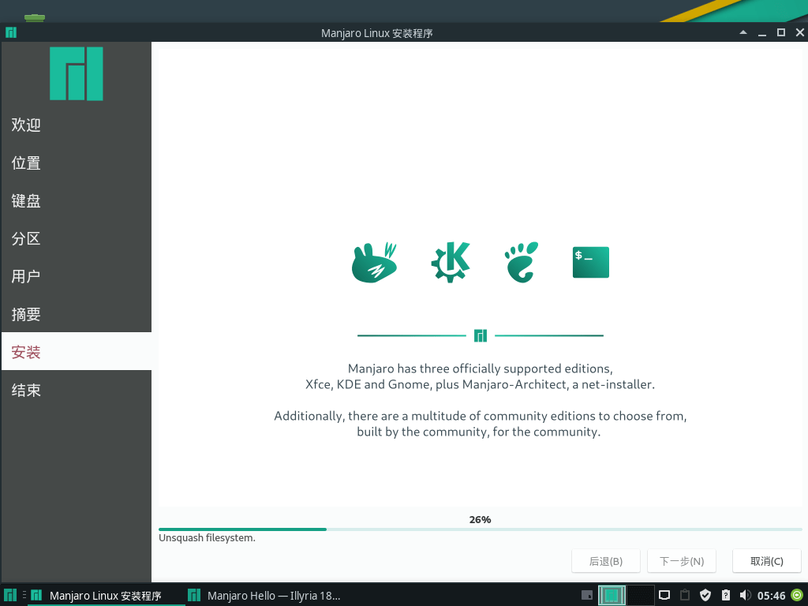

##




1.首先更新一下密钥，如果没有安装archlinux-keyring,请及时安装

sudo pacman-key --refresh-keys
2.重新加载相应的签名密钥

sudo pacman-key --init
sudo pacman-key --populate
3。清除pacman 的缓冲文件

sudo pacman -Scc
4.更新或者安装系统即可

sudo pacman -Syu --lsb

 
pacman -S git
pacman -S mercurial
pacman -S man gcc  base-devel git tar perl make openssl

```
cd ~
wget https://dl.google.com/go/go1.4.3.linux-amd64.tar.gz
tar –xvzf  go1.4.3.linux-amd64.tar 

mv go go1.4
cd go1.4/src
sudo apt-get install bison ed gawk gcc libc6-dev make
sudo CGO_ENABLED=0 ./all.bash

sudo vim /etc/profile

// 必须是go1.4

export GOROOT=$HOME/go1.4
export GOBIN=$HOME/Code/Go/bin
export PATH=$PATH:$GOROOT/bin
export GOPATH=$HOME/Code/Go
export PATH=$PATH:$GOBIN:$GOPKG:$GOPATH/bin

source /etc/profile

wget https://dl.google.com/go/go1.11.4.linux-amd64.tar.gz
sudo tar –xvzf  go1.11.4.linux-amd64.tar.gz
mv go go1.11.4
cd go1.11.4/src
sudu ./all.bash

sudo vim /etc/profile
export GOROOT=$HOME/go1.11.4
source /etc/profile
重启就行了
go version

编译qt5.12

下载解压源码包

sudo ./configure -static -release -nomake examples -qt-sqlite -qt-zlib -qt-libpng -qt-libjpeg -openssl-linked -no-qml-debug -opengl -qt-freetype -no-angle -nomake tests  -skip qtdoc -prefix /usr/local/Qt5.12.0_static

make -j2
sudo make install
编译qt.inline


export GOROOT=$HOME/go1.11.4
export GOBIN=$HOME/Code/Go/bin
export PATH=$PATH:$GOROOT/bin
export GOPATH=$HOME/Code/Go
export PATH=$PATH:$GOBIN:$GOPKG:$GOPATH/bin:/usr/local/Qt5.12.0_static/bin/:/home/fjs/Code/Go/src/github.com/kitech/

编译qt.go
ok
```

