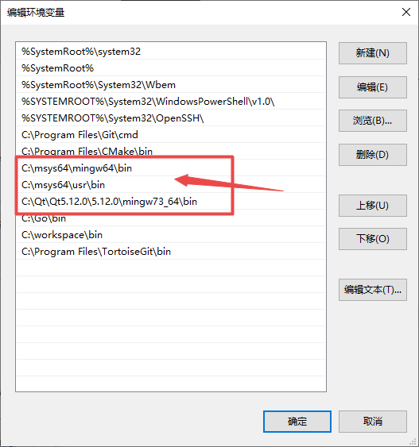
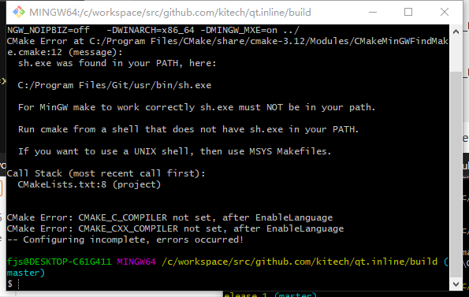
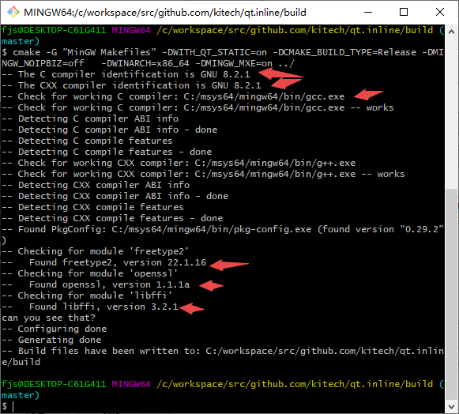
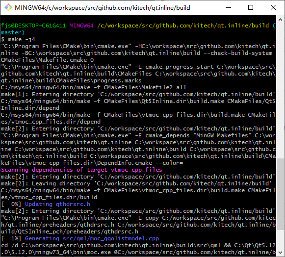

qt.go 安装qtline.go

因为官方的 qt.inline 发布的 releases版本是qt5.10的不适合当前版本.

故需要自己编译.
参考自动化编译过程和配置文件在qt.inline\.travis\xxx.xxx
https://travis-ci.org/kitech/qt.inline

可以学习和掌握,快速开发做准备,但是需要qt环境,必须的
可以从我的git上下载qt.go_demo\src\_1\


linux 平台:
如ubuntu 平台下 :
安装qt

apt-get install -y libffi-dev make gcc git curl cmake
apt-get install -y mesa-common-dev libglu1-mesa-dev freeglut3-dev

```
git clone https://github.com/kitech/qt.inline.git
cd qt.inline
cmake .
make
cp libQt5Inline.so /usr/lib/libQt5Inline.so
```

arch 平台需要安装的软件:编译过程同linux 平台,后一篇有编译过程及介绍

编译qt5.12

```
pacman -S --noconfirm cmake ccache man gcc  base-devel git tar perl make openssl mercurial
```


windows 平台:
需要安装的有
msys2:

pacman -S --noconfirm cmake ccache man gcc  base-devel git tar perl make openssl mercurial
pacman -S mingw-w64-x86_64-gtk3

// gtk里面有图形库的包,如freetype库,故装了就行了.不单独装了.

```
git clone https://github.com/kitech/qt.inline.git
cd qt.inline
mkdir build
cd build
cmake -G "MinGW Makefiles" -DWITH_QT_STATIC=on -DCMAKE_BUILD_TYPE=Release -DMINGW_NOIPBIZ=off   -DWINARCH=x86_64 -DMINGW_MXE=on ../

再次输入,
cmake -G "MinGW Makefiles" -DWITH_QT_STATIC=on -DCMAKE_BUILD_TYPE=Release -DMINGW_NOIPBIZ=off   -DWINARCH=x86_64 -DMINGW_MXE=on ../

make -j4 
```
环境变量为msys2的gcc，g++,make,和安装好qt5.12路径









历经很长时间，不到40分钟 就会生成dll。