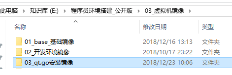

# 安装教程

## ubuntu 安装qt.go

这是整好的虚拟机镜像, ubuntu18.04 

链接:https://pan.baidu.com/s/1M6nCQp6-qX8NzX-_o28VfA 密码:tgix

里面有两个,一个是win10的qt.go,ubuntu18.04.装了qt5.12,go1.11.4,liteide.qt.go


下载,用vm打开,直接就可以跑了.用户 fjs 密码 qwqw123




参考之前ubuntu18.04的安装教程


https://blog.csdn.net/wrzfeijianshen/article/details/82820007

咱们直接用之前安装好的虚拟机,

链接:https://pan.baidu.com/s/1M6nCQp6-qX8NzX-_o28VfA 密码:tgix


因为很久没有更新了,故先更新

`sudo apt-get update && sudo apt-get dist-upgrade`

1.安装go环境,有几种方式

1. 直接下载二进制安装
以下是直接下载安装包.

```
wget https://dl.google.com/go/go1.10.3.linux-amd64.tar.gz
sudo tar -zxvf go1.10.3.linux-amd64.tar.gz -C /usr/local/
sudo mkdir -p /data/workspace/Golang
sudo vim /etc/profile

export GOROOT=/usr/local/go 
export GOBIN=$GOROOT/bin
export GOPKG=$GOROOT/pkg/tool/linux_amd64 
export GOARCH=amd64
export GOOS=linux
export GOPATH=/data/workspace/Golang
export PATH=$PATH:$GOBIN:$GOPKG:$GOPATH/bin
source /etc/profile 
```
2. 咱们采用编译的手段进行安装
通过官网下载 https://golang.google.cn/dl/

首先下载1.4的源码 go1.4.3.src.tar.gz

*.tar.gz和*.tgz 用 tar –xzf 解压

*.tar.bz2用tar –xjf 解压

```
cd ~
wget https://dl.google.com/go/go1.4.3.linux-amd64.tar.gz
tar –xvzf  go1.4.3.linux-amd64.tar.gz

mv go go1.4
cd go1.4/src
sudo apt-get install bison ed gawk gcc libc6-dev make
sudo CGO_ENABLED=0 ./all.bash

sudo vim /etc/profile

// 必须是go1.4

export GOROOT=$HOME/go1.4
export GOBIN=$HOME/Code/Go/bin
export PATH=$PATH:$GOROOT/bin
export GOPATH=$HOME/Code/Go
export PATH=$PATH:$GOBIN:$GOPKG:$GOPATH/bin

source /etc/profile

wget https://dl.google.com/go/go1.11.4.linux-amd64.tar.gz
sudo tar –xvzf  go1.11.4.linux-amd64.tar.gz
mv go go1.11.4
cd go1.11.4/src
sudu ./all.bash

sudo vim /etc/profile
export GOROOT=$HOME/go1.11.4
source /etc/profile
重启就行了
go version
```


安装qt5.12.0

http://download.qt.io/archive/qt/5.12/5.12.0/

下载 qt-opensource-linux-x64-5.12.0.run

双击安装,默认路径也行 /home/fjs/Qt5.12.0 ,一般选择opt目录,咱这里默认了;全选安装.

设置路径

sudo vim /etc/profile
export PATH=$PATH:$GOBIN:$GOPKG:$GOPATH/bin:/home/fjs/Qt5.12.0/5.12.0/gcc_64/bin
source /etc/profile

测试 rcc -v

安装 liteide 和 vscode

https://sourceforge.net/projects/liteide/files

sudo tar -zxvf liteidex35.3.linux64-qt5.5.1.tar.gz -C /usr/local
sudo vim /etc/profile
export PATH=$PATH:$GOBIN:$GOPKG:$GOPATH/bin:/home/fjs/Qt5.12.0/5.12.0/gcc_64/bin:/usr/local/liteide/bin
source /etc/profile

http://kr.archive.ubuntu.com/ubuntu/pool/main/libp/libpng/libpng12-0_1.2.54-1ubuntu1_amd64.deb

dpkg -i libpng12-0_1.2.54-1ubuntu1_amd64.deb

添加桌面图标后,安装git,下载代码编译即可.

go get -u -v github.com/kitech/qt.go/...

sudo apt-get install libffi-dev cmake libgtk2.0-dev pkg-config

go build -v github.com/kitech/qt.go/...
go install -v github.com/kitech/qt.go/...


pacman -S libffi cmake

wget https://github.com/kitech/qt.inline/releases/download/v1.0-rc4/qt510_linux_x64_static.tar.bz2

cp libQt5Inline.so /usr/lib/libQt5Inline.so
cd $GOPATH/src/github.com/kitech/qt.go/examples
go build button.go
./button

