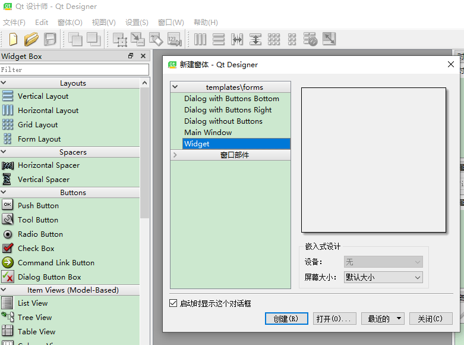
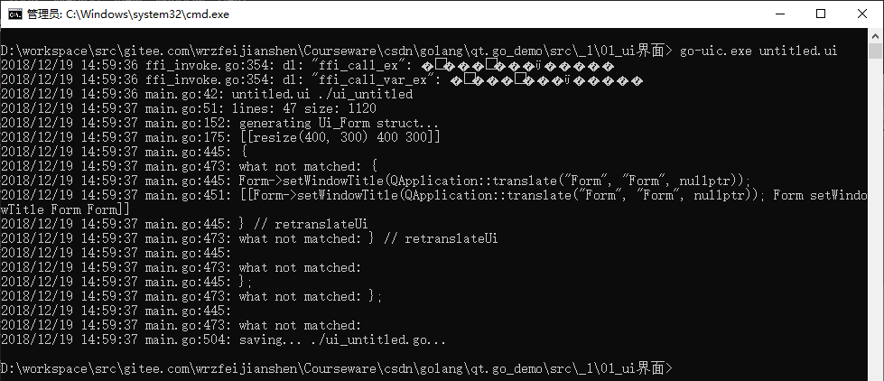
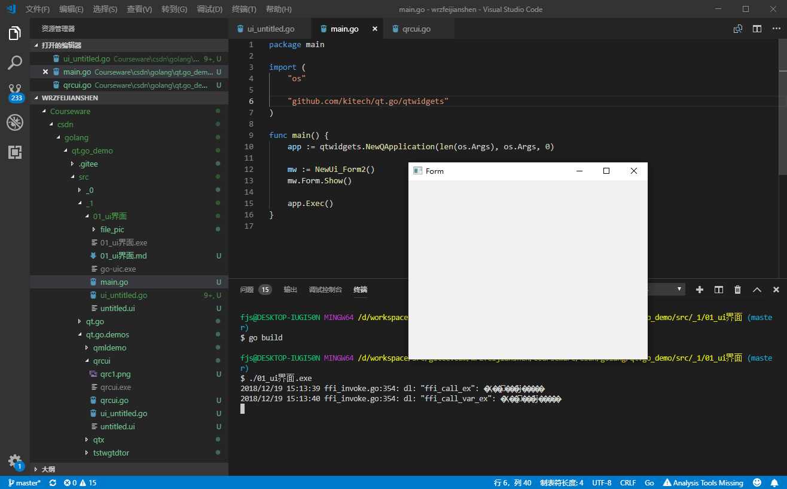

# 开发流程

因开发速度较快,故采用qt的Designer来进行界面开发,用go-uic进行生成ui.go文件.再进行逻辑代码编写.

因升级5.12版本官方的go-ui有些问题,故采用这个目录下的go-uic.exe.其源文件在Courseware\csdn\golang\qt.go_demo\src\qt.go\cmd\go-uic

1.创建ui文件

用Designer创建widget.保存即可.



用命令行执行 go-uic.exe untitled.ui,会生成ui_untitled.go文件



2.创建main.go

```
package main

import (
	"os"

	"github.com/kitech/qt.go/qtwidgets"
)

func main() {
	app := qtwidgets.NewQApplication(len(os.Args), os.Args, 0)

	mw := NewUi_Form2()
	mw.Form.Show()

	app.Exec()
}
```

```
 执行 go build  或者执行 go build -ldflags="-H windowsgui" 生成,没有黑窗口.
```




