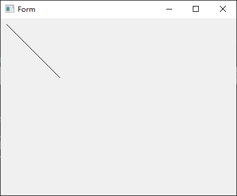
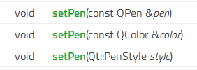
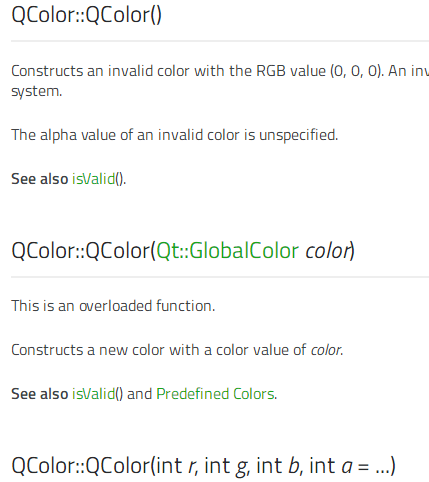
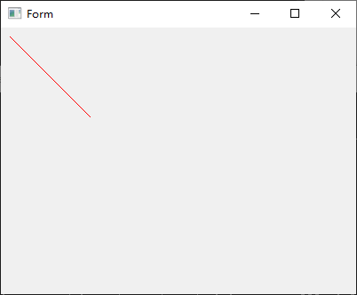
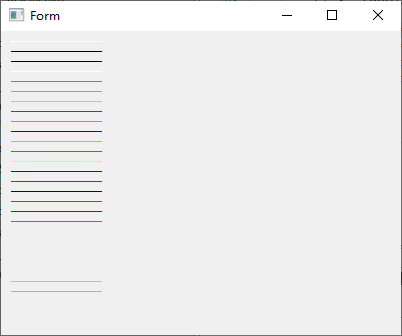
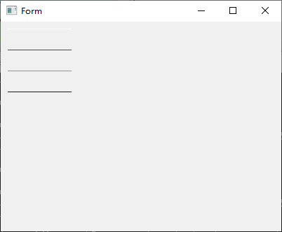
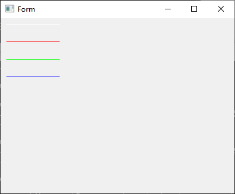

# 02_画线_SetPen_qcolor

由于本人的技术末流,故仅供参考.

在群友的大力帮助下,搞定了.咱们一般在widget 上直接进行画线.

参考官网帮助 和http://doc.qt.io/qt-5/classes.html 和 http://www.kuqin.com/qtdocument/index.html

关于本节代码在的 paintEvent 事件 可以用 InheritInitPainter 函数进行调用.

1.本节代码在 01_ui界面画线, 进行改造.拷贝一份到 02_画线

```
	f1 := func(painter *qtgui.QPainter) {
		painter.SetPen2(1)
		painter.DrawLine2(10, 10, 100, 100)
	}
	mw.Form.InheritInitPainter(f1)
```


InheritInitPainter 的源码 指的是含有 QWidget的控件可以调用,参数为func函数,
故定义了f1的函数在上方,当然也有别的方法进行定义,这里就不多举例了.

func (this *QWidget) InheritInitPainter(f func(painter *qtgui.QPainter /*777 QPainter **/) /*void*/)

咱们在f1所定义出来的匿名函数中,进行各种绘制.所用到的函数参数是 painter *qtgui.QPainter,这里可以说明是painter如何操作,参考 http://doc.qt.io/qt-5/qpainter.html

这里面有很多例子和函数说明.

而比如设置 SetPen

qt帮助文档中和qtgo源码中,如下,在c++中,函数重载,在go中不允许,故采用名称1,名称2,参数变成golang 的,根据参数的字母顺序决定1,2,3的顺序. 使用上其实差不多.

故可以参考kitech\qt.go\docs\name-conversion.md
中一些介绍.
```
* QtCore => qtcore.
* QtGui => qtgui.
* QtWidgets => qtwidgets.

`show() => Show()`

`arg() => Arg1()`
类构造函数 在类名中添加“New”前缀:“NewQPushButton(…)”

protected methods
Add `Inherit` prefix to method name: `InheritMouseMoveEvent(...)`

class internal enums
`QWidget::DrawWindowBackground`
`QWidget::DrawChildren`
### QString Except `QString` class wrapper itself, all other `QString` are replaced with go `string`.

```

```
qt src:
void	setPen(const QPen &pen)
void	setPen(const QColor &color)
void	setPen(Qt::PenStyle style)

golang src:
func (this *QPainter) SetPen(color QColor_ITF)
func (this *QPainter) SetPen1(pen QPen_ITF)
func (this *QPainter) SetPen2(style int)
```



咱们用func (this *QPainter) SetPen(color QColor_ITF)
来进行写,其余的函数也都是大同小异的,以一通万通了.

咱们先定义color QColor_ITF这样一个参数.
参考文档 http://doc.qt.io/qt-5/qcolor.html



代码中体现,故可以发现,初始化时,在qtgo中,变成了New类型1,2等等.

```
c++ src:
QColor::QColor(Qt::GlobalColor color)
QColor::QColor(int r, int g, int b, int a = ...)
QColor::QColor(QRgb color)

go src : 
func (*QColor) NewForInherit() *QColor
func (*QColor) NewForInherit1(color int) *QColor
func (*QColor) NewForInherit2(r int, g int, b int, a int) *QColor

// 具体实现
func NewQColor() *QColor
func NewQColor1(color int) *QColor
func NewQColor2(r int, g int, b int, a int) *QColor
```

在源码中,如下,具体头文件和函数名称 NewForInherit的所代表的qt中的就是void QColor() 函数

```
// /usr/include/qt/QtGui/qcolor.h:70  头文件
// index:0
// Public inline Visibility=Default Availability=Available
// [-2] void QColor()    函数名称

/*
Constructs an invalid color with the RGB value (0, 0, 0). An invalid color is a color that is not properly set up for the underlying window system.

The alpha value of an invalid color is unspecified.

See also isValid().
*/

func (*QColor) NewForInherit() *QColor {
	return NewQColor()
}

```

func (*QColor) NewForInherit1(color int) *QColor 所代表的就是void QColor(Qt::GlobalColor)

故 Qt::GlobalColor参数 所代表的就是color int ;
即 : http://doc.qt.io/qt-5/qt.html#GlobalColor-enum

```
Qt::white	3	White (#ffffff)
Qt::black	2	Black (#000000)
Qt::red	7	Red (#ff0000)
Qt::darkRed	13	Dark red (#800000)
Qt::green	8	Green (#00ff00)
Qt::darkGreen	14	Dark green (#008000)
Qt::blue	9	Blue (#0000ff)
Qt::darkBlue	15	Dark blue (#000080)
Qt::cyan	10	Cyan (#00ffff)
Qt::darkCyan	16	Dark cyan (#008080)
Qt::magenta	11	Magenta (#ff00ff)
Qt::darkMagenta	17	Dark magenta (#800080)
Qt::yellow	12	Yellow (#ffff00)
Qt::darkYellow	18	Dark yellow (#808000)
Qt::gray	5	Gray (#a0a0a4)
Qt::darkGray	4	Dark gray (#808080)
Qt::lightGray	6	Light gray (#c0c0c0)
Qt::transparent	19	a transparent black value (i.e., QColor(0, 0, 0, 0))
Qt::color0	0	0 pixel value (for bitmaps)
Qt::color1	1	1 pixel value (for bitmaps)
```

执行代码后,注意 mw.Form.InheritInitPainter(f1)// 不能同时执行多次,否则会报错的.

```
		f1 := func(painter *qtgui.QPainter) {
			var qcolor qtgui.QColor
			//s := qcolor.NewForInherit()// 默认颜色
			s := qcolor.NewForInherit1(7)
			painter.SetPen(s)
			painter.DrawLine2(10, 10, 100, 100)
		}

		mw.Form.InheritInitPainter(f1)
		//mw.Form.InheritInitPainter(f1)// 不能同时执行多次
```




```
		// 多线颜色
		f1 := func(painter *qtgui.QPainter) {
			var qcolor qtgui.QColor
			for i := 0; i <= 30; i++ {
				s := qcolor.NewForInherit1(i)
				painter.SetPen(s)
				painter.DrawLine2(10, 10+i*10, 100, 10+i*10)
			}
		}
		mw.Form.InheritInitPainter(f1)
```


至此已经成功的显示出画线了,其余的例子与这个大同小异了,怎么调用参数怎么传参和qt中的操作基本一致了.注意传参,就基本就可以了.

NewForInherit2 : 线的参数查http://doc.qt.io/archives/4.3/qcolor.html#QColor-2等可以知道原参数的含义,即rgba,a是透明度,0-255之间.


```
	//  多线颜色 NewForInherit2 rgba
		f1 := func(painter *qtgui.QPainter) {
			var qcolor qtgui.QColor

			// [-2] void QColor(int, int, int, int)
			// 查帮助文档 QColor::QColor(int r, int g, int b, int a = ...)
			// QColor::QColor ( int r, int g, int b, int a = 255 )
			// func (*QColor) NewForInherit2(r int, g int, b int, a int) *QColor
			s := qcolor.NewForInherit2(255, 255, 255, 255)
			painter.SetPen(s)
			painter.DrawLine2(10, 10, 100, 10)
			s = qcolor.NewForInherit2(255, 0, 0, 255)
			painter.SetPen(s)
			painter.DrawLine2(10, 40, 100, 40)
			s = qcolor.NewForInherit2(0, 255, 0, 255)
			painter.SetPen(s)
			painter.DrawLine2(10, 70, 100, 70)
			s = qcolor.NewForInherit2(0, 0, 255, 255)
			painter.SetPen(s)
			painter.DrawLine2(10, 100, 100, 100)
		}
		mw.Form.InheritInitPainter(f1)
```




把上述的代码中的 NewForInherit2 改为 NewForInherit2p 即为rgb

