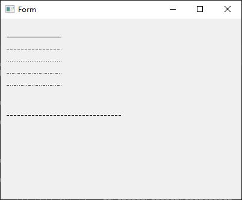

# 02_画线

http://doc.qt.io/qt-5/qt.html#GlobalColor-enum有些全局的变量如

```
Qt::ImhHiddenText
Qt::Key_Escape
Qt::white
```

在kitech\qt.go\qtcore\qnamespace.go

Qt Namespace 中定义了很多的全局变量值,咱们可以在qnamespace.go 找到对应的名称

如上例子中int 7,就可以Qt__red来代替.

```
		f1 := func(painter *qtgui.QPainter) {
			var qcolor qtgui.QColor

			s := qcolor.NewForInherit1(qtcore.Qt__red)

			painter.SetPen(s)
			painter.DrawLine2(10, 10, 100, 100)
		}
		mw.Form.InheritInitPainter(f1)
```
## Pen Style

```
		f1 := func(painter *qtgui.QPainter) {
			//func (this *QPainter) SetPen2(style int) style :0-6
			for i := 0; i < 6; i++ {
				painter.SetPen2(i)
				painter.DrawLine2(10, 10+i*20, 100, 10+i*20)
			}

			painter.SetPen2(qtcore.Qt__DashLine)
			painter.DrawLine2(10, 10+150, 200, 10+150)
		}
		mw.Form.InheritInitPainter(f1)
```
这仅仅是开个头,让大家熟悉如何定义使用,建议还是要熟悉qt这个开源框架,才能够顺利上手.如何画线画各种图形,留做以后在专门章节阐述.

