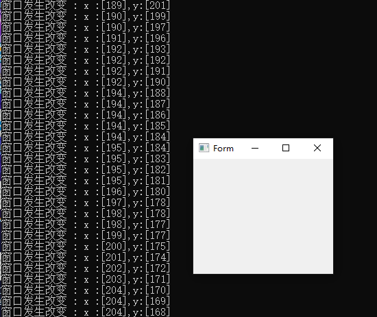
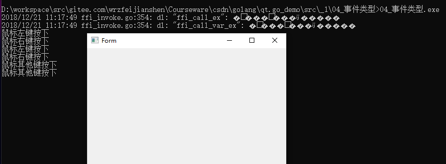
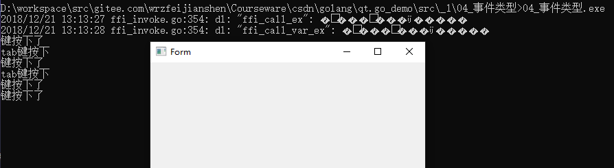
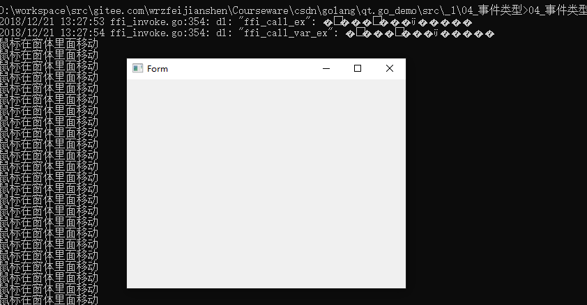

# 04 事件类型

咱们的例子暂且以 作者: 一去丶二三里 的脚步,来逐步实现qt.go的使用.

原文链接 ：https://blog.csdn.net/liang19890820/article/details/51932033 

在Qt中,事件就是对象,派生自QEvent抽象类,用来表示在应用程序中发生的事件.或是应用程序需要处理的外部活动产生的事件.

Events可以被任何QObject派生的子类实例对象接收和处理,但它们是关联到特定控件的.

事件类型

Qt为多数事件类型建立了相应的类，常见的有：QResizeEvent、QPaintEvent、QMouseEvent、QKeyEvent、QCloseEvent。

上面例子中咱们使用了QPaintEvent 事件.mw.Form.InheritInitPainter(f1),即这个控件的绘图事件.

下面逐步使用其余的几个事件,供大家参考.

每一个特定的事件类都继承自QEvent,并添加特定的事件函数

QResizeEvent添加了size()和oldSize()让控件可以发现它们的尺寸发生了的怎么改变.

QMouseEvent就支持鼠标按键按下事件、双击事件、移动事件、以及其它相关操作所引发的事件.

每一个事件都有一个关联的类型,由QEvent::Type定义,运行时可以很方便的检测每个事件对象的事件类型,以快速的判断该事件对象构造自哪个事件类.

### QResizeEvent 事件

QResizeEvent事件可以采用InheritResizeEvent来进行调用.基本事件都是这种Inherit + QXXXXXEvent来进行调用的,一通万通了,其余的也都是类似.

QResizeEvent这个事件是改变窗口大小时,就会去调用的.每当把窗口拉大或者是缩小,就会去调用这个事件.

```
f1 := func(event *qtgui.QResizeEvent) {
	x := mw.Form.Width()
	y := mw.Form.Height()
	fmt.Printf("窗口发生改变 : x :[%d],y:[%d]\n", x, y)
}
// QResizeEvent
// Inherit + QResizeEvent
mw.Form.InheritResizeEvent(f1)
```
		


### mousePressEvent 鼠标事件

mousePressEvent 鼠标按下的一些操作,这里只是简单的模拟了点下的操作.点在Form窗体上.

```
f1 := func(event *qtgui.QMouseEvent) {
	if event.Button() == qtcore.Qt__LeftButton {
		fmt.Println("鼠标左键按下")
	} else if event.Button() == qtcore.Qt__RightButton {
		fmt.Println("鼠标右键按下")
	} else {
		fmt.Println("鼠标其他键按下")
	}
}
mw.Form.InheritMousePressEvent(f1)
```



### QKeyEvent 按键事件

因为go 继承使用不熟悉,故先如此了,InheritEvent 事件中,有按键操作,当然也有自定义按键,去参考一些例子实现吧.故先略.

key := qtgui.QKeyEvent{&qtgui.QInputEvent{event}}

```
f1 := func(event *qtcore.QEvent) bool {
	if event.Type() == qtcore.QEvent__KeyPress {
		fmt.Println("键按下了")

		// key1 := qtgui.QInputEvent{event}
		// key := qtgui.QKeyEvent{&key1}

		// 继承QEvent <- QInputEvent <- QKeyEvent
		key := qtgui.QKeyEvent{&qtgui.QInputEvent{event}}
		if key.Key() == qtcore.Qt__Key_Tab {
			fmt.Println("tab键按下")
		}
	}
	return true
}

mw.Form.InheritEvent(f1)
```


### 鼠标移动事件

```
f1 := func(event *qtgui.QMouseEvent) {
	//fmt.Println("鼠标来了111111: ", event.Type())
	if event.Type() == qtcore.QEvent__MouseMove {
		// 操作,鼠标左键按住窗体里面,左键移动不松开
		fmt.Println("鼠标在窗体里面移动")
	}
}
mw.Form.InheritMouseMoveEvent(f1)
```

