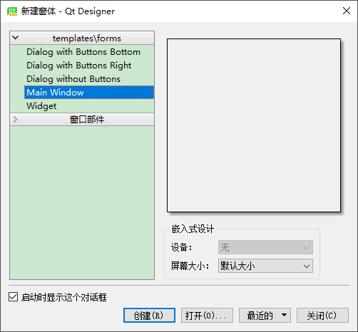

# 05 窗口

### QWidget

QWidget类是所有用户界面对象的基类。

窗口部件是用户界面的一个原子：它从窗口系统接收鼠标、键盘和其它事件，并且将自己的表现形式绘制在屏幕上。每一个窗口部件都是矩形，并且它们按Z轴顺序排列。一个窗口部件可以被它的父窗口部件或者它前面的窗口部件盖住一部分。

QWidget有很多成员函数，但是它们中的一些有少量的直接功能：例如，QWidget有字体属性，但是自己从来不用。为很多继承它的子类提供了实际的功能，比如QLabel、QPushButton、QCheckBox等等。

这是之前咱们创建出来的widget窗口


### QMainWindow

QMainWindow类提供一个有菜单条、工具栏、状态条的主应用程序窗口（例如：开发Qt常用的IDE-Visual Studio、Qt Creator等）。

一个主窗口提供了构建应用程序的用户界面框架。Qt拥有QMainWindow及其相关类来管理主窗口。

QMainWindow拥有自己的布局，我们可以使用QMenuBar（菜单栏）、QToolBar（工具栏）、QStatusBar（状态栏）以及QDockWidget（悬浮窗体），布局有一个可由任何种类小窗口所占据的中心区域。


使用原则:

如果需要嵌入到其他窗体中，则基于QWidget创建。

如果是顶级对话框，则基于QDialog创建。

如果是主窗体，则基于QMainWindow创建。

下面咱们作为主窗口如何创建:

用qt设计师,创建Main Window,保存为mainWindow.ui后，用go-uic.exe mainWindow.ui 生成.go文件




添加main.go
```
func main() {
	app := qtwidgets.NewQApplication(len(os.Args), os.Args, 0)

	mw := NewUi_MainWindow2()
	mw.MainWindow.Resize(200, 200)
	mw.MainWindow.Show()

	app.Exec()
}
```


可以看到生成的ui.mainWindow.go,文件中, Ui_MainWindow的子类.QMainWindow 可以理解为整个大窗口,里面有Menubar和Statusbar,还有中间的区域QWidget

```
type Ui_MainWindow struct {
	Centralwidget *qtwidgets.QWidget
	Menubar       *qtwidgets.QMenuBar
	Statusbar     *qtwidgets.QStatusBar
	MainWindow    *qtwidgets.QMainWindow
}
```

可以在QWidget画线,在添加以下代码就可以实现了,是不是很简单.

```
if true {
	f1 := func(painter *qtgui.QPainter) {
		painter.SetPen2(1)
		painter.DrawLine2(10, 10, 100, 100)
	}
	mw.Centralwidget.InheritInitPainter(f1)
}
```

