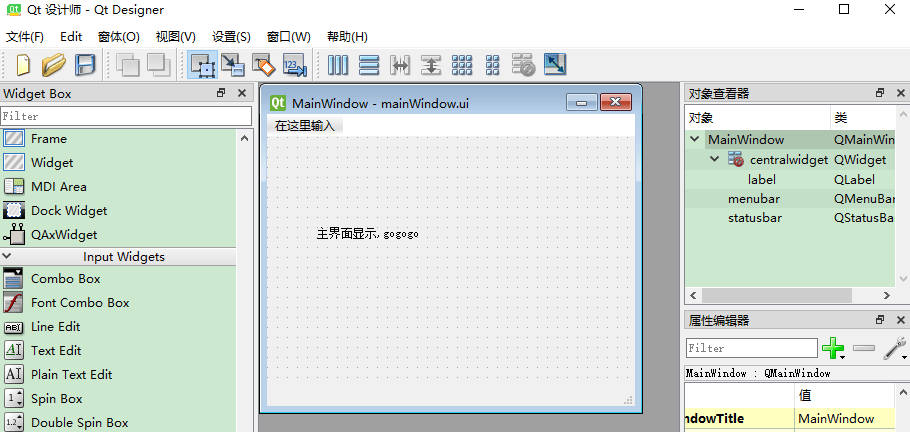
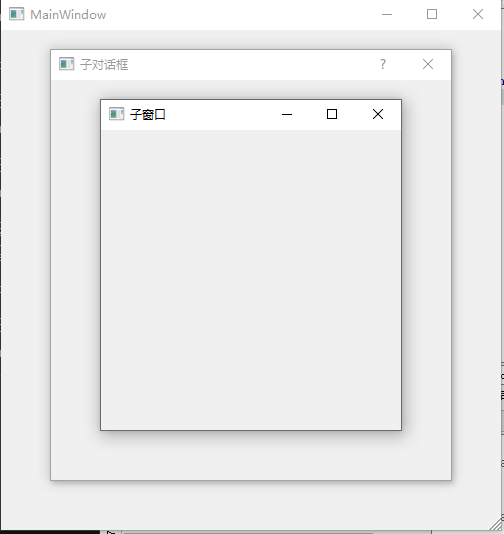

# 06 模式对话框

调整ui,界面上添加一个Label


go-uic 生成ui.go

这就是新建弹出一个模态对话框和模态窗口的一个例子.

```
	mw := NewUi_MainWindow2()
	mw.MainWindow.Resize(500, 500)
	mw.MainWindow.Show()
	pDialog := qtwidgets.NewQDialog(nil, 0)
	pDialog.Resize(400, 400)
	pDialog.SetWindowTitle("子对话框")
	pDialog.SetModal(true) // 设置模态
	pDialog.Show()

	pWidget := qtwidgets.NewQWidget(nil, 0)
	pWidget.Resize(300, 300)
	pWidget.SetWindowTitle("子窗口")
	pWidget.SetWindowModality(qtcore.Qt__ApplicationModal) // 设置模态
	pWidget.Show()
```

