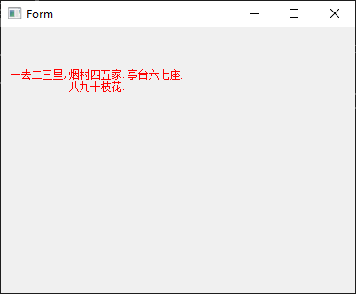
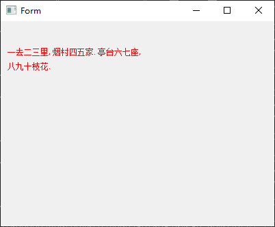
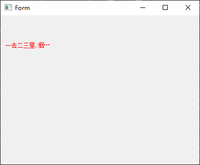
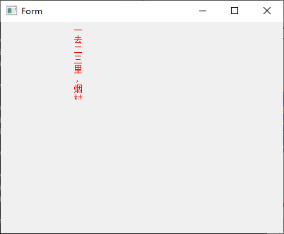
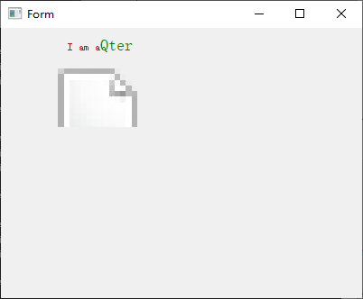
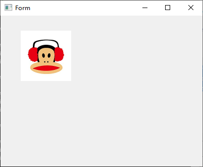

# 07 Qlabel

添加Widget界面上添加一个Label,go-uic 生成ui.go,在Ui_Form里面有Label *qtwidgets.QLabel控件,咱们就进行操作QLabel,当然一些属性在设计师里面就可以直接修改,添加.

```
type Ui_Form struct {
	Label *qtwidgets.QLabel
	Form  *qtwidgets.QWidget
}
```
我们可以看到 ui.go中的定义构造.
```
this.Label = qtwidgets.NewQLabel(this.Form, 0) // 111
this.Label.SetObjectName("Label")              // 112
this.Label.SetGeometry(40, 30, 54, 12)         // 114

```

通过调用setText可以为标签设置文本（Hello World），这时标签就可以正常显示出来了。为了显示更佳的效果，我们可以通过调用setStyleSheet来设置样式。color: red-顾名思义，就是为标签设置一个文本色（红色）。

在main中

```
	mw := NewUi_Form2()
	mw.Label.SetText("hello world")
	mw.Label.SetGeometry(10, 10, 200, 100)
	mw.Label.SetStyleSheet("color:red")

	mw.Form.Show()
```

对齐方式

默认的标签文本对齐方式为：左对齐、垂直居中，我们可以通过setAlignment来设置，包括：左、上、右、下、居中对齐，一般情况，我们会进行两两组合（水平方向、垂直方向）。


```
mw.Label.SetAlignment(qtcore.Qt__AlignCenter) // 居中对齐
// 使用样式表来控制（水平居右、垂直居下）：
//mw.Label.SetStyleSheet("qproperty-alignment: 'AlignBottom | AlignRight';")

// 自动换行
mw.Label.SetWordWrap(true)
strText := "一去二三里,烟村四五家.亭台六七座,八九十枝花."

mw.Label.SetText(strText)
```



```
mw.Label.SetAlignment(qtcore.Qt__AlignCenter) // 居中对齐
// 使用样式表来控制（水平居右、垂直居下）：
//mw.Label.SetStyleSheet("qproperty-alignment: 'AlignBottom | AlignRight';")

// 自动换行
mw.Label.SetWordWrap(true)
strText := "一去二三里,烟村四五家.亭台六七座,八九十枝花."

mw.Label.SetText(strText)
```




// 省略
```
strText := "一去二三里,烟村四五家.亭台六七座,八九十枝花."
strElidedText := mw.Label.FontMetrics().ElidedText(strText, qtcore.Qt__ElideRight, 100, qtcore.Qt__TextShowMnemonic)
mw.Label.SetText(strElidedText)
```


// 垂直显示
```
strText := "一去二三里,烟村四五家.亭台六七座,八九十枝花."
// 思路 每个字添加\n,自己写方法实现哦
strText = "一\n去\n二\n三\n里\n,\n烟\n村\n四\n五\n家\n.\n亭\n台\n六\n七\n座\n,\n八\n九\n十\n枝\n花\n.\n"
mw.Label.SetText(strText)
mw.Label.SetAlignment(qtcore.Qt__AlignCenter)
```



// 富文本
```
strText := "<html><head><style> font{color:red;} #f{font-size:18px; color: green;} </style>  </head>  <body>  <font>I am a</font><font id=\"f\">Qter</font> <br/><br/>          </body>         </html>"

mw.Label.SetText(strText)
// 图片不显示,待研究
// strText1 := "<html><body>  </body> </html>"
// mw.Label.SetText(strText1)
mw.Label.SetAlignment(qtcore.Qt__AlignCenter)
```


// 图片不显示,待研究

```
var pixmap *qtgui.QPixmap
// 不支持jpg,QPixmap/QImage不能读取jpg图像,但是可以读取bmp,png图像。
// "bmp", "pbm", "pgm", "png", "ppm", "xbm", "xpm" ,也就是目前只能支持这些格式。
pixmap = pixmap.NewForInherit3p("./Images/logo2.bmp")
mw.Label.SetPixmap(pixmap)
mw.Label.SetFixedSize1(100, 100)
mw.Label.SetScaledContents(true)
```



```
// 好像不支持jpg动画
var pMovie *qtgui.QMovie
pMovie = pMovie.NewForInherit2p("d:\\zb.gif")
mw.Label.SetMovie(pMovie)
mw.Label.SetFixedSize1(125, 125)
mw.Label.SetScaledContents(true)
pMovie.Start()
```

显示数字

`mw.Label.SetNum1(66.666) // 显示数字`

超链接
```
mw.Label.SetText("<a href = \"http://blog.csdn.net/wrzfeijianshen\">飞剑神</a>")
mw.Label.SetOpenExternalLinks(true)
```