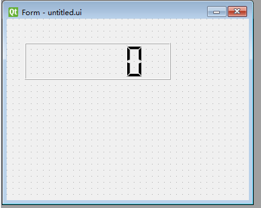
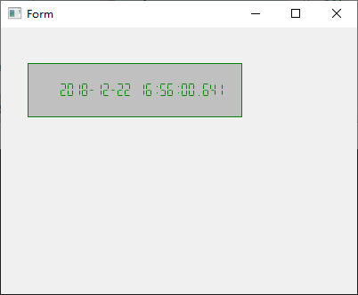

# 07 LCD Number

添加Widget界面上添加一个LCD Number ,go-uic 生成ui.go,在Ui_Form里面有Label *qtwidgets.QLabel控件,咱们就进行操作QLabel,当然一些属性在设计师里面就可以直接修改,添加.



参考博客

http://www.kuqin.com/qtdocument/qlcdnumber.html#Mode-enum
http://doc.qt.io/qt-5/qlcdnumber.html#Mode-enum

```
// 设置能够显示的位数
mw.LcdNumber.SetDigitCount(25)

// 设置显示的模式为十进制
mw.LcdNumber.SetMode(qtwidgets.QLCDNumber__Dec)
//mw.LcdNumber.SetMode(qtwidgets.QLCDNumber__Hex)

// 设置显示外观
mw.LcdNumber.SetSegmentStyle(qtwidgets.QLCDNumber__Flat)

// 显示样式
mw.LcdNumber.SetStyleSheet("border: 1px solid green; color: green; background: silver;")
mw.LcdNumber.Display1(20191222)

// 构建定时器
// var timer *qtcore.QTimer
// timer = timer.NewForInheritp()
timer := qtcore.NewQTimer(nil)

timer.SetInterval(1000)

// qtrt.Connect(timer, "timeout()", func() {
// 	fmt.Println("hehehhe222")
// })
qtrt.Connect(timer, "timeout()", func() {
	// 获取系统当前时间
	// var datime *qtcore.QDateTime
	// datime = datime.CurrentDateTimeUtc()
	datime := qtcore.QDateTime_CurrentDateTime()
	mw.LcdNumber.Display(datime.ToString1("yyyy-MM-dd HH:mm:ss.zzz"))
})
timer.Start1()

```
