# 09 资源系统

资源系统包含一些图片,之前用go-uic 生成界面文件.而资源文件在qt中用*.qrc.

Qt 的资源系统用于存储应用程序的可执行二进制文件,采用平台无关的机制.
当你的程序总需要这样的一系列文件(图标、翻译文件等)并且不想冒丢失某些文件的风险时,这就显得十分有用.

## 资源集合文件（.qrc）

与程序相关的资源在被指定在一个 .qrc 文件中,其基于 XML的文件格式列出了磁盘上的文件,可以为它们指定一个应用程序访问资源时必须使用的资源名称.

```
<RCC>
  <qresource>
    <file>images/logo1.png</file>
  </qresource>
</RCC>

```
咱们手动的新建一个文件 01_rcc.qrc,在里面添加以上代码.
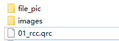
注意images/logo1.png文件必须在01_rcc.qrc的当前目录或子目录

咱们用go-rcc.exe 01_rcc.qrc 来编译
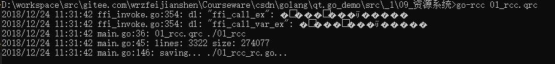

注意若编译不是上方出现的样子,用git bash 来编译,
咱们在程序中,新建一个 QLabel,和07_QLabel界面代码是一样的.
在main函数中
```
mw.Label.SetGeometry(10, 10, 200, 200)
// 不支持jpg,QPixmap/QImage不能读取jpg图像,但是可以读取bmp,png图像。
// "bmp", "pbm", "pgm", "png", "ppm", "xbm", "xpm" ,也就是目前只能支持这些格式。
//var pixmap *qtgui.QPixmap
//pixmap = pixmap.NewForInherit3p("/images/logo1.png")
pixmap := qtgui.NewQPixmap3p(":/images/logo1.png")
mw.Label.SetPixmap(pixmap)
mw.Label.SetFixedSize1(100, 100)
mw.Label.SetScaledContents(true)
```

`go build` 

编译后执行

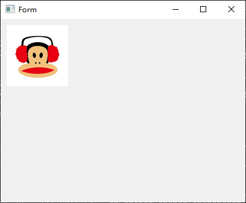

咱们可以这样依次增加图片文件等等.需要带有 ":/"前缀，或者有qrc scheme的URL。

例如 :/images/logo1.png 或者 ://images/logo1.png ,这看起来第一个更为方便.
```
mw.Label.SetGeometry(10, 10, 200, 200)
pixmap := qtgui.NewQPixmap3p("://images/logo1.png")
mw.Label.SetPixmap(pixmap)
mw.Label.SetFixedSize1(100, 100)
mw.Label.SetScaledContents(true)
```

都可以访问在程序代码树中位置为 images/logo1.png 的 logo1.png文件.

用文件标签的别名属性可以改变访问名称:

1.把资源文件复制一份修改为02_rcc.qrc ,并修改为
```
<RCC>
  <qresource>
    <file alias="logo1-img.png">images/logo1.png</file>
  </qresource>
</RCC>

```
main 代码修改为

```
mw.Label.SetGeometry(10, 10, 200, 200)
pixmap := qtgui.NewQPixmap3p(":/logo1-img.png")
mw.Label.SetPixmap(pixmap)
mw.Label.SetFixedSize1(100, 100)
mw.Label.SetScaledContents(true)
```

`go-rcc 02_rcc.qrc`
`go build`
之后在程序中就可以使用:/logo1-img.png 访问此文件了. 但感觉不如路径有感觉.

其实 rcc的前缀默认为 /,即 qresource prefix="/". 如,和上面的例子01_rcc.qrc差不了多少.

```
<RCC>
  <qresource prefix="/">
    <file>images/logo1.png</file>
  </qresource>
</RCC>

```

咱们可以借助 Qt Designer 来建立qrc资源.首先随便建立一个窗口,在界面的右下角.

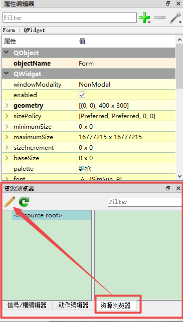

点击这个笔,保存为04_rcc.qrc,添加前缀"/",或者在右键弹出的弹窗,点击添加前缀,后面添加文件.


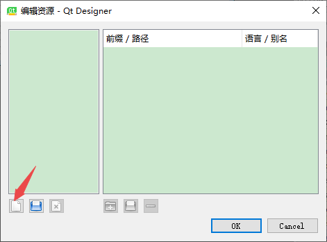

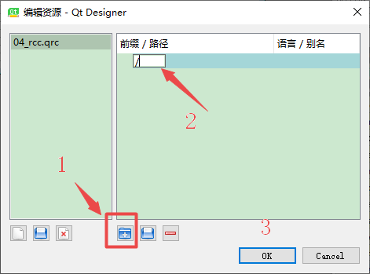

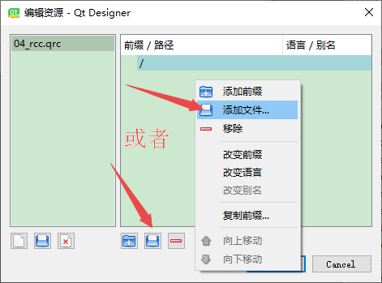

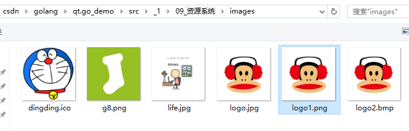

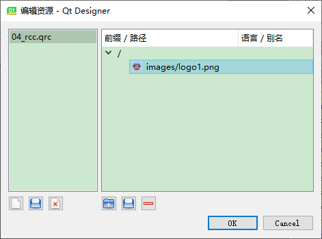

点击ok后, 会有图片出来,右键有复制路径 :/images/logo1.png ;

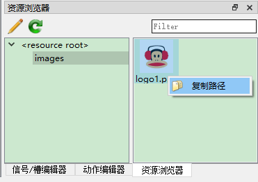

发现生成的文件为 :
```
<RCC>
  <qresource prefix="/">
    <file>images/logo1.png</file>
  </qresource>
</RCC>
```
当然前缀不一样情况就不一样.

还可以使用 qresource 标签的前缀属性为 .qrc 文件中列出的所有文件指定路径前缀:

比如再次添加前缀 .qrc文件变为qresource prefix="/Images;

其中的g8.png 路径为 :/Images/images/g8.png
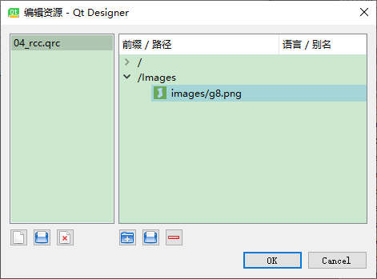

```
<RCC>
  <qresource prefix="/">
    <file>images/logo1.png</file>
  </qresource>
  <qresource prefix="/Images">
    <file>images/g8.png</file>
  </qresource>
</RCC>
```

修改源代码后

`pixmap := qtgui.NewQPixmap3p(":/Images/images/g8.png")`

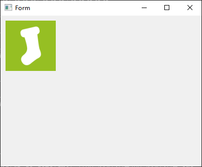


