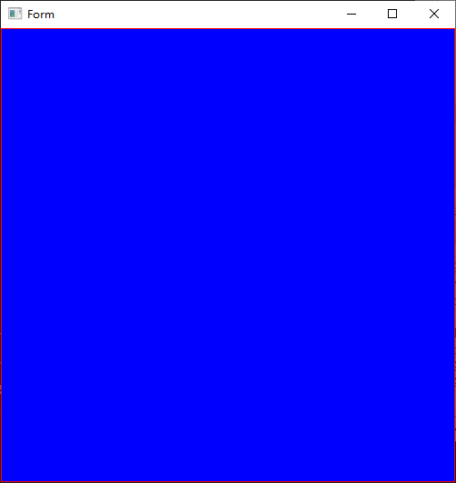
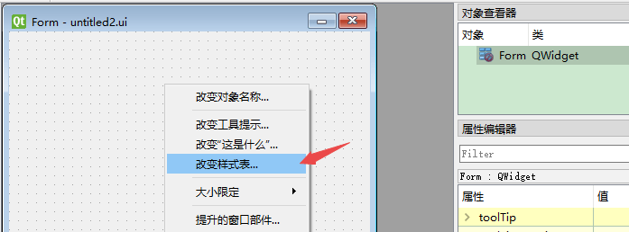
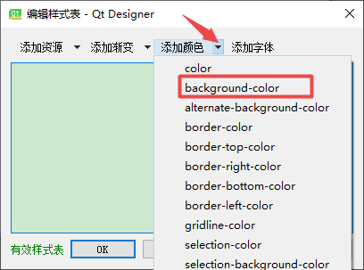
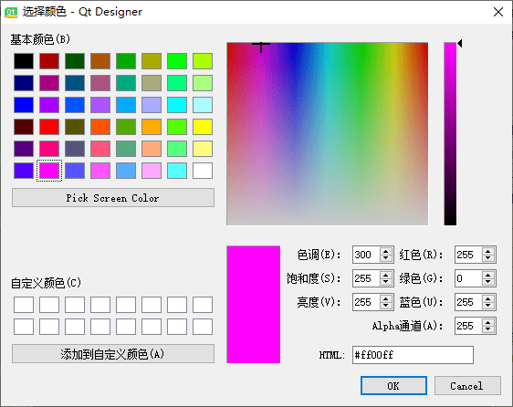
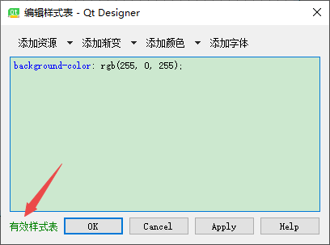
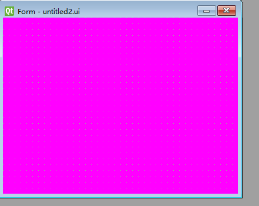
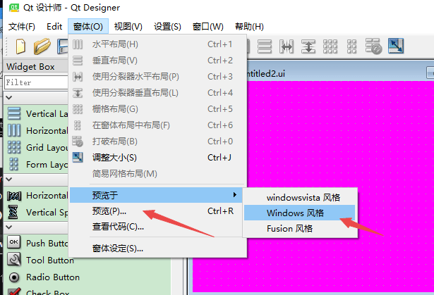
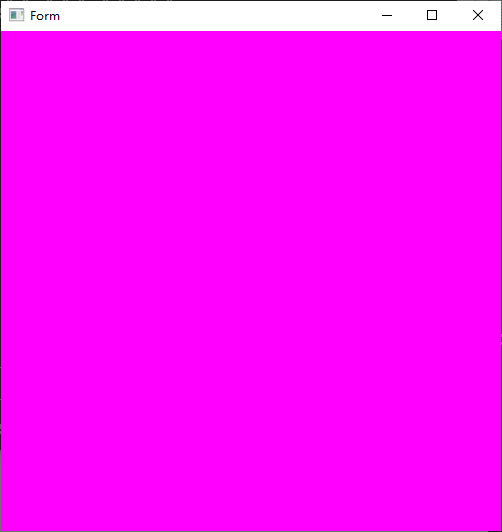

# qss

参考 https://www.cnblogs.com/wangqiguo/p/4960776.html#_label6

QSS称为Qt Style Sheets也就是Qt样式表,它是Qt提供的一种用来自定义控件外观的机制.QSS大量参考了CSS的内容,只不过QSS的功能比CSS要弱很多,体现在选择器要少,可以使用的QSS属性也要少很多,并且并不是所有的属性都可以用在Qt的所有控件上.

QSS的语法规则几乎与CSS相同.一条QSS的样式是由两部分组成的,一部分是选择器指定了哪些控件会受到影响,另一部分是指定了属性的值,表示这些控件的哪些属性会受到影响.例如
:QPushButton { color: red }
```
QSS的选择器类型
1.通配选择器：*  ; 匹配所有的控件
2.类型选择器：QPushButton ; 匹配所有QPushButton和其子类的实例
3.属性选择器：QPushButton[flat="false"]; 匹配所有flat属性是false的QPushButton实例，注意该属性可以是自定义的属性，不一定非要是类本身具有的属性
4.类选择器：  .QPushButton ;  匹配所有QPushButton的实例，但是并不匹配其子类。这是与CSS中的类选择器不一样的地方，注意前面有一个点号
5.ID选择器：  #myButton; 匹配所有id为myButton的控件实例，这里的id实际上就是objectName指定的值
6.后代选择器： QDialog QPushButton ; 所有QDialog容器中包含的QPushButton，不管是直接的还是间接的
7.子选择器：  QDialog > QPushButton; 所有QDialog容器下面的QPushButton，其中要求QPushButton的直接父容器是QDialog
```

可参考下面博客.
https://blog.csdn.net/wzs250969969/article/category/7265376/1
https://blog.csdn.net/qq21497936
https://blog.csdn.net/qq21497936/article/details/79401577

在go中访问qss和qt是一致的.下面介绍两种方法.

1. 在main函数中加载qss.创建最为简单的widget窗口,保存即可.

创建main.qss文件,添加下面代码即可.
```
QWidget{
	border: 1px solid rgb(255,0,0);
	background: blue;
}
```
在main函数添加以下代码
```
// 加载qss
qss := qtcore.NewQFile1("./main.qss")
ret := qss.Open(qtcore.QIODevice__ReadOnly)
if ret {
	// str := qtcore.NewQString()
	// a := qss.ReadAll()
	// str := str.Operator_equal5(a)
	// mw.Form.SetStyleSheet(str)
	str := qtcore.QString_FromUtf81(qss.ReadAll())
	mw.Form.SetStyleSheet(str)
	qss.Close()
}
```

QByteArray 转成 string

func QString_FromUtf81(str QByteArray_ITF) string

SetStyleSheet : 是加载样式表的函数,简单的意思就是加载qss里面写的内容.



2. 方法2,咱们可以借助qt designer 来操作.

右键控件,一般指定某控件添加样式.





选择背景色,比如这个淡红色,点击确定






另存为一份untitled2.ui,会发现代码中出现 background-color: rgb(255, 0, 255);

```
<property name="styleSheet">
    <string notr="true">background-color: rgb(255, 0, 255);</string>
</property>
````

这些样式都写在ui里面了,不在go代码中操作了,故不用打开qss文件了
可以预览窗体.选择预览或者预览于都可以.



go-uic untitled2.ui,得删除之前的 ui.go文件,go build ,运行代码,会发现就能够显示了



