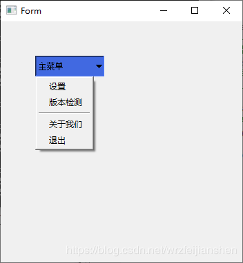

# menu

咱们在一个按钮上弹出menu菜单操作.
首先创建一个简单窗口就行.

咱们1是布局控件(控件如何放),2是借助qss样式,把控件美化

添加main.qss

```
QPushButton {
        /* 水平居左、垂直居中 */
        text-align: left center;
        padding-left: 3px;
		background: RoyalBlue;
}
QPushButton::menu-indicator {
        subcontrol-position: right center;
        subcontrol-origin: padding;
        padding-right: 3px;
        /* image: none; */
}
```

main 添加qss,之后就不写了,看源码就能看到

```
if true {
	// 加载qss
	qss := qtcore.NewQFile1("./main.qss")
	ret := qss.Open(qtcore.QIODevice__ReadOnly)
	if ret {
		str := qtcore.QString_FromUtf81(qss.ReadAll())
		mw.Form.SetStyleSheet(str)
		qss.Close()
	}
}
```

创建qmenu

```
qmenu := qtwidgets.NewQMenu(mw.Form)
qmenu.AddAction("设置")
qmenu.AddAction("版本检测")
qmenu.AddSeparator()
qmenu.AddAction("关于我们")
qmenu.AddAction("退出")
```
创建按钮

```
btn := qtwidgets.NewQPushButton(mw.Form)
btn.SetText("主菜单")
btn.SetFixedSize1(100, 30)
btn.Move(50, 50)
btn.SetMenu(qmenu)
```

当你点击按钮时,就会弹出来




