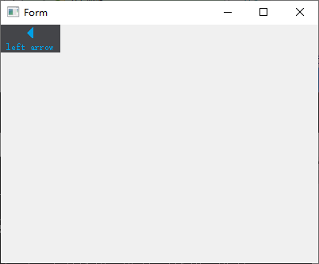
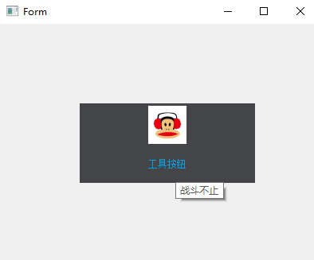

# toolbutton

QToolButton类提供了用于命令或选项可以快速访问的按钮,通常可以用在QToolBar里面.

工具按钮和普通的命令按钮不同,通常不显示文本,而显示图标.

常用接口 : 

1. void setMenu(QMenu * menu) 同上节

2. void setPopupMode(ToolButtonPopupMode mode) 
设置弹出菜单的方式,默认情况下:设置为DelayedPopup（延迟弹出）.

```
常量	                        值	           描述
QToolButton::DelayedPopup	0	按下按钮一定时间后(超时风格依赖,参考:QStyle::SH_ToolButton_PopupDelay),显示菜单.一个典型案例:浏览器中工具栏的“后退”按钮.
QToolButton::MenuButtonPopup	1	这种模式下,工具按钮显示一个特殊的箭头以指示菜单是否存在,按下按钮的箭头部分时显示菜单.
QToolButton::InstantPopup	2	按下工具按钮时菜单显示,无延迟.这种模式下,按钮自身的动作不触发.
```

3. void setToolButtonStyle(Qt::ToolButtonStyle style) 

设置按钮风格,只显示一个图标,文本或文本位于图标旁边、下方.默认值是Qt::ToolButtonIconOnly.

```
常量	                         值	描述
Qt::ToolButtonIconOnly	         0	只显示图标
Qt::ToolButtonTextOnly           1	只显示文本
Qt::ToolButtonTextBesideIcon	 2	文本显示在图标旁边
Qt::ToolButtonTextUnderIcon	 3	文本显示在图标下边
Qt::ToolButtonFollowStyle	 4	遵循QStyle::StyleHint
```

4. void setArrowType(Qt::ArrowType type) 
设置按钮是否显示一个箭头，而不是一个正常的图标。这将显示一个箭头作为QToolButton的图标。 
默认情况下，这个属性被设置为Qt::NoArrow。
枚举Qt::ArrowType: Qt::LeftArrow


```
// 工具栏
qtoolbtn := qtwidgets.NewQToolButton(mw.Form)
//qtoolbtn.SetArrowType(qtcore.Qt__DownArrow)
qtoolbtn.SetArrowType(qtcore.Qt__LeftArrow)

qtoolbtn.SetText("left arrow")
qtoolbtn.SetToolButtonStyle(qtcore.Qt__ToolButtonTextUnderIcon)
//qtoolbtn.SetStyleSheet("QToolButton{border: none; background: rgb(68, 69, 73); color: rgb(0, 160, 230);}")

```


```
qAction := qtwidgets.NewQAction(mw.Form)

qAction.SetText("工具按钮")
icon := qtgui.NewQIcon2(":/images/logo1.png")
qAction.SetIcon(icon)
qtoolbtn := qtwidgets.NewQToolButton(mw.Form)
qtoolbtn.SetIconSize(qtcore.NewQSize1(48, 48))
qtoolbtn.Move(100, 100)
qtoolbtn.SetFixedSize1(220, 100)

qtoolbtn.SetDefaultAction(qAction)
qtoolbtn.SetToolButtonStyle(qtcore.Qt__ToolButtonTextUnderIcon)
qAction.SetToolTip("战斗不止")
```

鼠标停到这个button上,等一秒就会有这个战斗不止字样

