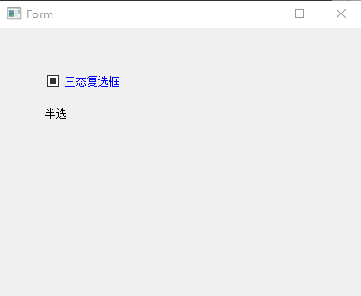
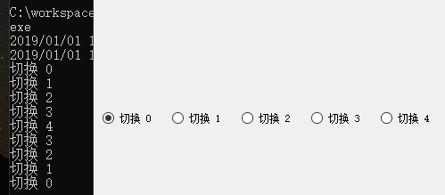

#QCheckBox 和 QRadioButton

## QCheckBox

QCheckBox 提供了一个带文本标签的复选框.
QCheck 和QRadioBUtton(单选框),都是属于选项按钮,在开和关之间切换.
单选框定义了多选一,复选框提供的是多选多.

复选框被选中或者清除,都会发射stateChanged()信号, isChecked()来查询复选框是否被选中.


```
Qt::CheckState checkState() const 
返回复选框的选中状态。如果不需要三态的支持，可以使用QAbstractButton::isChecked()，它返回一个布尔值。

bool isTristate() const 
复选框是否为一个三态复选框.

默认的是false，也就是说复选框只有两个状态。

void setCheckState(Qt::CheckState state) 
设置复选框的选中状态。如果不需要三态的支持，可以使用QAbstractButton:setChecked()，它接受一个布尔值。

void setTristate(bool y = true) 
设置复选框为一个三态复选框.
```


```
qCheckbox := qtwidgets.NewQCheckBox(mw.Form)
qCheckbox.SetText("三态复选框")
qCheckbox.SetTristate(true) // 开启三态模型

qCheckbox.SetCheckState(qtcore.Qt__PartiallyChecked)
qCheckbox.Move(50, 50)
label := qtwidgets.NewQLabel(mw.Form, 0)
label.Move(50, 80)
label.SetFixedSize1(100, 30)
label.SetText("Click CheckBox...")
if qCheckbox.IsTristate() {
	fmt.Println("是三态状态")
}

// 信号槽相应
qtrt.Connect(qCheckbox, "stateChanged(int)", func(iVal int) {
	if iVal == qtcore.Qt__Checked {
		label.SetText("选中了")
	} else if iVal == qtcore.Qt__PartiallyChecked {
		label.SetText("半选")
	} else {
		label.SetText("Unchecked")
	}
})
```



## QRadioButton

QRadioButton部件提供了一个带有文本标签的单选框（单选按钮）

单选框默认开启自动互斥（autoExclusive）.如果启用了自动互斥，属于同一个父部件的单选框的行为就和属于一个互斥按钮组的一样.如果你需要为属于同一父部件的单选框设置多个互斥按钮组,把它们加入QButtonGroup中.

每当一个按钮切换选中或未选中状态时,会发出的toggled()信号.如果希望每个按钮切换状态时触发一个动作,连接到这个信号.使用isChecked()来查看特定按钮是否被选中.

```
m_pHBoxLayout := qtwidgets.NewQHBoxLayout1(mw.Form)
m_pButtonGroup := qtwidgets.NewQButtonGroup(mw.Form)

m_pButtonGroup.SetExclusive(true)
for i := 0; i < 5; i++ {
	m_pRadioBtn := qtwidgets.NewQRadioButton(mw.Form)
	str := fmt.Sprintf("%s %d", "切换", i)

	m_pRadioBtn.SetText(str)
	m_pHBoxLayout.AddWidgetp(m_pRadioBtn)
	// m_pButtonGroup.AddButtonp(m_pRadioBtn)// 默认id从-2 -3开始
	m_pButtonGroup.AddButton(m_pRadioBtn, i)
}
m_pHBoxLayout.SetSpacing(10)
m_pHBoxLayout.SetContentsMargins(10, 10, 10, 10)
mw.Form.SetLayout(m_pHBoxLayout)
// 信号槽相应
qtrt.Connect(m_pButtonGroup, "buttonClicked(int)", func(iVal int) {
	str := fmt.Sprintf("%s %d", "切换", iVal)
	fmt.Println(str)
})
```

